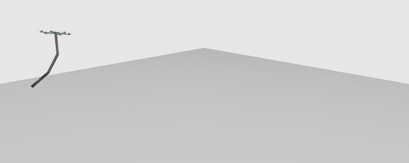

# Aerial manipulator — tube-based LPV-MPC



A hexarotor carrying a three-link arm has a problem a plain drone does not: every
time the arm moves, it pushes back on the vehicle. Swing the shoulder and the
aircraft rolls; accelerate the wrist and the attitude loop sees a torque it never
asked for. The usual fix is to estimate that reaction and cancel it after the
fact, which works while the arm is slow and falls apart when it is not.

This project reimplements, in ROS 2 and Gazebo, a scheme that treats the reaction
differently: it is written out in terms of the vehicle's own states, folded into a
linear parameter-varying (LPV) model, and handed to a robust MPC that plans with
it instead of reacting to it. One MPC flies the vehicle's rotation, a second one
drives the arm, and both are compared against a reaction-cancelling baseline.

It is an independent reimplementation of the method described in

> A. Eskandarpour, M. Soltanshah, K. Gupta, M. Mehrandezh,
> *Decoupled Dynamic Modeling by Decomposing the Cross-Coupled Dynamics and
> Tube-Based LPV-MPC Control Scheme for Aerial Manipulation*,
> IEEE Transactions on Aerospace and Electronic Systems, 61(5), 2025.
> [doi:10.1109/TAES.2025.3576083](https://doi.org/10.1109/TAES.2025.3576083)

written by Giorgio De Santis and Matteo Zamponi for the Aerial Robotics course at
Sapienza. The paper itself is not included here and nothing is copied from it: no
text, figures or tables. The theory below is a summary in our own words of what the
code does, the results come from our own simulations, and everything that departs
from the original is stated as such. This repository is not affiliated with or
endorsed by the paper's authors.

---

## 📖 Theory

### The coupling problem

The vehicle is a rigid body with position $\xi$, attitude $\eta = (\phi, \theta, \psi)$
and body rate $\omega = (p, q, r)$. The arm hangs below it with joint angles
$\Theta \in \mathbb{R}^3$. Newton–Euler for the vehicle alone would read

```math
m\ddot{\xi} = R(\eta)\,\big(f_z e_3 + f_{rea}\big) - m g e_3, \qquad
I\dot{\omega} = -\omega \times I\omega + \tau + \tau_{rea}
```

and everything interesting sits in $f_{rea}$ and $\tau_{rea}$, the force and torque
the arm exerts on the vehicle at its mount. They depend on the arm's configuration,
its velocities and accelerations — and on the vehicle's own motion, because the arm
is riding on it.

### Writing the reaction in the vehicle's states

Run the recursive Newton–Euler equations of the arm outward from the vehicle and
back inward, and look at the torque that arrives at the base. Collect its terms by
how they depend on the vehicle's rotation, and the reaction torque splits as

```math
\tau_{rea} = M_d\,\dot{\omega}
+ M_c\begin{bmatrix} pq \\ qr \\ pr \end{bmatrix}
+ M_s\begin{bmatrix} p^2 \\ q^2 \\ r^2 \end{bmatrix}
+ M_l\,\omega + \bar{\tau}
```

and the reaction force as $f_{rea} = M_f f_z + \bar{f}$. The $3 \times 3$ matrices
depend only on the arm's state $(\Theta, \dot\Theta, \ddot\Theta)$; $\bar\tau$ and
$\bar f$ collect whatever is left once the vehicle's rotation and thrust are taken
out.

Written this way the coupling stops being a disturbance. $M_d$ moves to the left-hand
side and becomes extra inertia, $I - M_d$; the quadratic terms become a state matrix
once one factor of the rate is treated as a scheduling parameter; and only the
residual $\bar\tau$ is left on the input side.

The code gets the matrices in closed form. `derive_dynamics.py` runs the project's own
Newton–Euler recursion symbolically with SymPy and writes `generated_dynamics.py`;
the closed form agrees with the numerical recursion to about $10^{-15}$.

### LPV models, in plain words

An MPC needs a *linear* model, $x_{k+1} = A x_k + B u_k$, and neither the vehicle's
rotation nor the arm is linear. The way around it: at every control step, take the
quantities that make the equations nonlinear, plug in their measured values, and
treat them as known numbers for that step. What is left is linear in the state, so
the MPC can use it. At the next step the numbers are measured again and $A$, $B$ are
rebuilt. A model that is linear at each instant but whose matrices change with
measured "parameters" is a **linear parameter-varying (LPV)** model.

| | rotation of the vehicle | arm |
|---|---|---|
| state $x$ | body rate $\omega = [p, q, r]$ | joint angles and speeds $[\Theta, \dot\Theta]$ |
| input $u$ | rotor torque $\tau$, plus the arm residual $\bar\tau$ | joint torque $\tau_{arm}$, plus a constant $T$ |
| what makes it nonlinear | products of rates such as $pq$ or $q^2$ | the $\sin$ terms in gravity; $M$ and $C$ depend on the pose |
| how it is made linear | one factor of each product is replaced by its measured value: $pq$ becomes (measured $p$) times $q$ | gravity is replaced by its tangent at the current pose, $G \approx Q\Theta - T$; $M$ and $C$ are evaluated at the measured pose |
| where the arm shows up | the decomposition above: $M_d$ adds to the inertia, $M_c$, $M_s$, $M_l$ to the rate terms | it *is* the arm |

For the rotation this gives, with $I$ the vehicle's inertia and $M_c^{tot}$,
$M_s^{tot}$ including the vehicle's own gyroscopic term,

```math
\dot\omega = (I - M_d)^{-1}\Big[\big(M_c^{tot}\,\mathrm{diag}(q, r, p) + M_s^{tot}\,\mathrm{diag}(p, q, r) + M_l\big)\,\omega + (\tau + \bar\tau)\Big]
```

where the entries of the two `diag` matrices are the measured rates. For the arm,
the usual $M\ddot\Theta + C\dot\Theta + G = \tau_{arm}$ becomes
$M\ddot\Theta + C\dot\Theta + Q\Theta = \tau_{arm} + T$, which is linear in
$[\Theta, \dot\Theta]$ once $M$, $C$, $Q$ are frozen for the step. Both continuous
models are then turned into the discrete $A$, $B$ the MPC uses.

### Tube-based MPC

An LPV model is exact at the moment it is built and slightly wrong one step later,
because the parameters keep moving. The tube construction turns that error into a
bounded disturbance and plans around it:

1. A **nominal** system $\bar x_{k+1} = A\bar x_k + B\bar u_k$ is optimised by an ordinary
   QP over a short horizon.
2. The **real** input adds feedback on the gap between the two,
   $u = \bar u + K(x - \bar x)$, with $K$ the LQR gain of the current LPV model.
3. The gap $e = x - \bar x$ stays inside a set that grows along the horizon by how much
   the parameters can drift per step. The QP's state and input limits are
   **tightened** by exactly that set (a Minkowski difference), so whatever the
   feedback adds on top of the nominal plan still fits inside the real limits.

| | what it does |
|---|---|
| $\bar u$ | the optimiser's plan, computed on the nominal model |
| $K(x - \bar x)$ | pulls the real state back toward the plan |
| tightened constraints | leave room for that correction inside the actuator limits |
| scheduled $K$ | re-solved each step, so the tube stays contractive as the arm folds |

### The control cascade

```
position reference ──► PD ──► force demand ──► thrust + attitude reference
                                                       │
                                  geometric attitude error → body-rate reference
                                                       │
                                     tube LPV-MPC (rotation) ──► vehicle torques
joint reference ─────────────────── tube LPV-MPC (arm) ─────────► joint torques
```

The arm's reaction enters in two places: $\bar f$ is subtracted from the force demand
before thrust and attitude are computed, and the full decomposition sits inside the
rotational LPV model.

### Baseline: ERTF

The comparison scheme, *Estimating Reaction Torque and Force*, computes the reaction
with Newton–Euler and cancels it as feedforward, with PID closing the attitude and
joint loops. In this implementation the estimate uses the previous step's angular
acceleration, since the current one is only known after the torque has been chosen;
the faster the arm moves, the more that lag costs.

### What differs from the paper

- **Position loop.** A PD with critical damping replaces the translational MPC. That
  stage is a plain constrained linear MPC and is not one of the paper's contributions;
  it is kept in the code (`UAM_TRANS_MPC=1`) but not on the default path.
- **Attitude reference.** Roll and pitch are taken from the standard
  body-z-axis construction, symmetric in the two axes, and the attitude error is the
  geometric one on SO(3), which does not degenerate at large angles.
- **Arm gravity.** Linearised with its tangent at the current pose instead of the
  paper's `sinc` substitution. Same structure, exact at the current pose.
- **Tube gain.** $K$ is re-solved at every step for the current LPV model; the paper
  computes it once, offline. With the arm folded, the offline gain made the tube
  grow without bound.
- **Discretisation.** Zero-order hold instead of forward Euler. The arm's mass matrix
  is badly conditioned and forward Euler is unstable at this sample time.
- **Control rate.** 20 Hz, half the rate of the paper's parameters: that is what a
  Python/OSQP controller holds against Gazebo on a laptop.
- **Terminal set.** The robust invariant terminal set is computed and verified, but
  is off by default (`UAM_TERMINAL_SET=1`): with a four-step horizon it
  over-constrains the QP. The flying configuration uses a Riccati terminal cost.

---

## 📊 Results

Tracking error in the Gazebo simulation, two runs per case, start-up transient
excluded, as a percentage of the reference amplitude:

| scenario | error on | tube LPV-MPC | ERTF |
|---|---|---|---|
| `nominal` | position | **4.9 %** | 14.1 % |
| `nominal` | joints | **4.8 %** | 149 % |
| `fast` | position | **9.2 %** | 13.0 % |
| `fast` | joints | **4.3 %** | 105 % |

Both schemes use the same PD position loop; they differ in how the vehicle's
rotation and the arm are controlled. The joint rows are the clean comparison: with
the reaction handled inside the model the arm tracks within 5 %, while the
baseline's error is larger than the reference itself. The position rows share the
outer loop, so the gap there is smaller and says less.

---

## 🚀 Running it

Tested on Ubuntu 22.04 (WSL2 works) with ROS 2 Humble and Gazebo Fortress.

```bash
# dependencies, once
sudo apt install -y ros-humble-desktop ros-humble-ros-gz \
  ros-humble-ros-gz-sim ros-humble-ros-gz-bridge \
  ros-humble-robot-state-publisher ros-humble-joint-state-publisher \
  ros-humble-xacro python3-colcon-common-extensions python3-pip

git clone https://github.com/giorgio0420/aerial-robotics-project ~/aerial-robotics-project
cd ~/aerial-robotics-project
pip install -r requirements.txt
source /opt/ros/humble/setup.bash
colcon build
source install/setup.bash

# fly one scenario: timeout in seconds, arm enabled
UAM_SCENARIO=nominal bash phase3.sh 95 true
```

The run writes `/tmp/trace.csv`. To read it:

```bash
python3 tools/iae.py run=/tmp/trace.csv                  # tracking-error table
python3 tools/report.py run=/tmp/trace.csv --out report  # plots
```

| variable | default | effect |
|---|---|---|
| `UAM_SCENARIO` | `nominal` | `hover`, `nominal` or `fast` |
| `UAM_USE_ERTF` | `0` | `1` flies the ERTF baseline instead of the tube MPCs |
| `UAM_TRANS_MPC` | `0` | `1` replaces the position PD with the translational MPC |
| `UAM_GUI` | `1` | `0` runs Gazebo headless, much cheaper on CPU |
| `UAM_TERMINAL_SET` | `0` | `1` imposes the robust terminal set |

Without a GPU, `phase3.sh` already forces software rendering. The GUI alone costs
several times the CPU of the control loop, so use `UAM_GUI=0` for measurements.

## Layout

```
phase3.sh                          one run: Gazebo, spawn, controller, release
src/hexacopter_sim/                XACRO model, launch file, ROS–Gazebo bridge
src/hexacopter_control/            Gazebo plugin: rotor speeds -> forces and torques
src/uam_control/hover_node.py      flight node: cascade, allocation, trace
src/uam_control/uam_control/       dynamics, decomposition, MPCs, ERTF, trajectories
src/uam_control/derive_dynamics.py regenerates generated_dynamics.py with SymPy
tools/                             iae.py, report.py — read a trace.csv
```

## Credits

The Gazebo hexarotor model in `src/hexacopter_sim/` is adapted from work by
mohit-mesh, released under the MIT License (see
[`src/hexacopter_sim/LICENSE`](src/hexacopter_sim/LICENSE)).

## License

The code in this repository is released under the MIT License, see [`LICENSE`](LICENSE).
The license covers this implementation only, not the paper it is based on.
